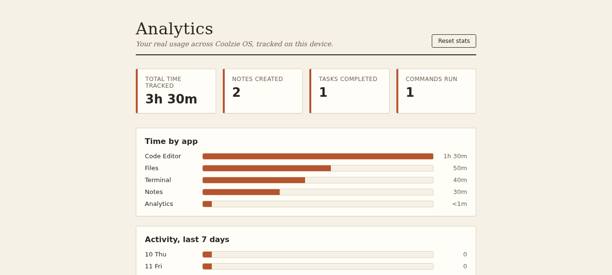

# CodeVault
​
Your desktop, in the browser. CodeVault is a Windows-style workspace for students and developers that bundles a code editor, notes, and tasks into one place. I built it because I wanted somewhere to code, note things down, and plan my day without juggling a bunch of tabs.
​
It's still in progress, but it works. Open the live site and you get a desktop-style home screen with app tiles, a search bar, and a taskbar. Click an app and it opens, like an OS should.
​
**Live preview: https://vanshwebdevloper.github.io/CodeVault**
​
## What's inside
​
- A home screen that looks and feels like a desktop OS, with app tiles you can launch and search
- A code editor for writing and running snippets
- A notes app for quick, no-friction notetaking
- A tasks app for keeping track of what needs doing
​
Nothing fancy under the hood. Plain HTML, CSS, and JavaScript. AI helped with the database side, the analytics tracking, some of the editor polish, and the responsiveness work.
​
## The apps
​
### Code Editor
​
A small IDE-style editor: an explorer sidebar, tabs, a commands search, and a Run button that shows the output below the code pane. Write something, run it, see what happens.
​

​
### Notes
​
Simple and easy, note it down before it slips away. Search your notes by name, give one a title, write it, save it. Works without signing in too.
​

​
### Tasks
​
Add, remove, or edit your tasks. Same idea as Notes: search by name, give it a title, add the details, save. Keeps your day on track without the clutter.
​

​
### Analytics

Real usage stats, tracked right in the browser. Every app logs events (notes created, tasks completed, commands run, files saved) and records how long you spend in each one, all stored per-account in localStorage. The dashboard shows total time tracked, notes created, tasks completed, commands run, a time-per-app breakdown, and activity over the last 7 days. Nothing leaves your machine.



### Terminal
​
<!-- TODO: what should the terminal do? run commands, navigate the OS? -->
​
A terminal is planned, same deal. Tile's there, app is coming.
​

​
### Files
​
<!-- TODO: describe what Files will manage once built -->
​
Files is planned as well, currently it's the tile on the right side of the desktop.
​

​
<!-- TODO: these are yours to fill in: -->
<!-- Why did you build CodeVault in your own words? (first section) -->
<!-- What's the plan after Terminal and Files? add a "roadmap" section here -->
<!-- Anything you want to credit or mention? people, tools, tutorials? -->
​
## Folder layout
​
```
CodeVault/
├── public/
│   ├── index.html           the desktop-style home screen
│   ├── main.css
│   ├── index.js             app launcher, search, taskbar
│   ├── apps/                the code editor, notes, and tasks apps etc.
│   │   ├── code-editor.html
│   │   ├── notes.html
│   │   ├── tasks.html
│   │   ├── js/              editor.js, notes.js, tasks.js etc.
│   │   └── css/             editor.css, notes.css, tasks.css etc.
│   └── assets/              wallpaper, icons, screenshots
│       └── screenshots/     the images used in this readme
```
​
## Contributing
​
Spotted something broken or have an idea? Open an issue, or fork the repo, make your branch, and send a pull request. I read everything.
​
## License
​
ISC. See LICENSE for the details.